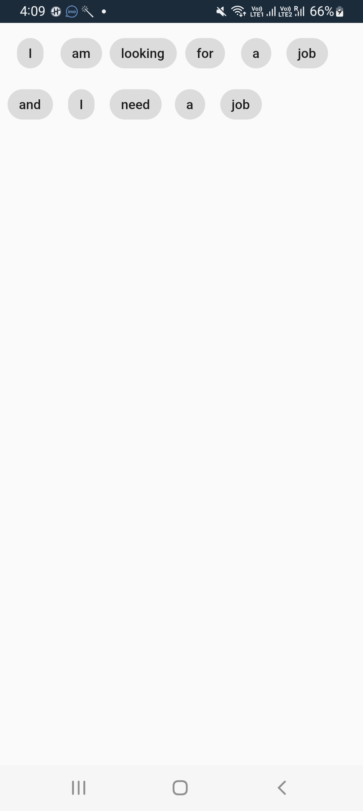

### B. Coding Questions:
  ##### 1.  Refactor the code below so that the children will wrap to the next line when the display width is small for them to fit.?
    ```
    import 'package:flutter/material.dart';
    class LongStringWidget extends StatelessWidget {
      const LongStringWidget({Key? key}) : super(key: key);

      @override
      Widget build(BuildContext context) {
        return SafeArea(
          child: Scaffold(
            body: Padding(
              padding: const EdgeInsets.all(8.0),
              child: Wrap(
                spacing: 6.0,
                runSpacing: 6.0,
                children: const [
                  Chip(label: Text('I')),
                  Chip(label: Text('am')),
                  Chip(label: Text('looking')),
                  Chip(label: Text('for')),
                  Chip(label: Text('a')),
                  Chip(label: Text('job')),
                  Chip(label: Text('and')),
                  Chip(label: Text('I')),
                  Chip(label: Text('need')),
                  Chip(label: Text('a')),
                  Chip(label: Text('job')),
                ],
              ),
            ),
          ),
        );
      }
    }
    ```
Output    


##### 2.  Identify the problem in the following code block and correct it.
  ```
    String longOperationMethod(){
      var counting =0;
      for(var i =1 ; i < 1000000000; i++){
        counting = i;
      }

      return '$counting time I print the value';
    }
  ```  
  
##### 3.   In the below code, list1 declared with var, list2 with final and list3 with const. What is the difference between these lists? Will the last two lines compile?

  ```
  var list1 = ['I', "test", 'flutter'];
  final list2 = list1;
  list2[2] ='Dart';
  const list3 = list1; // This line will give error . Not compile 
  ```  
