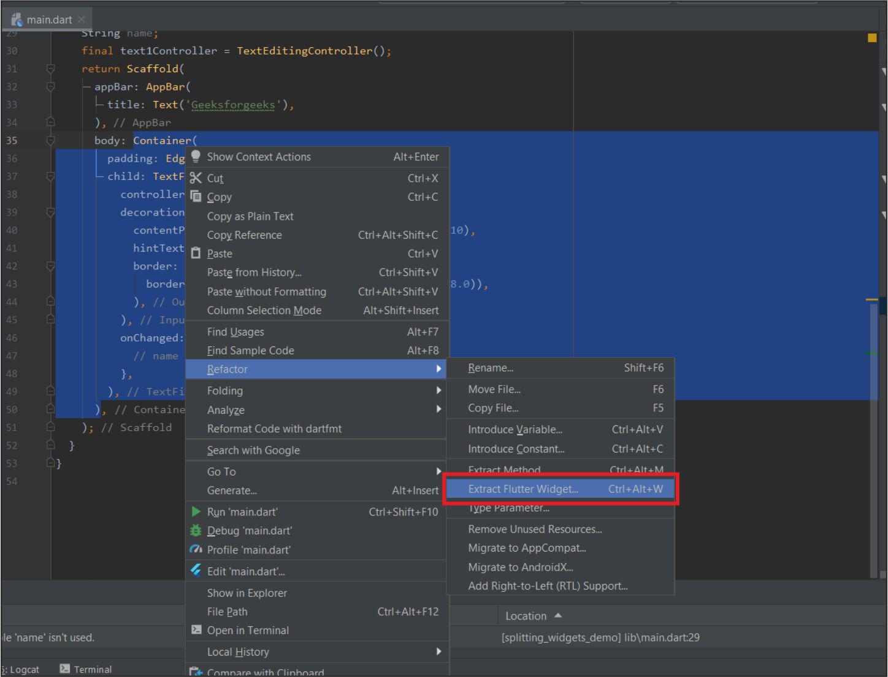
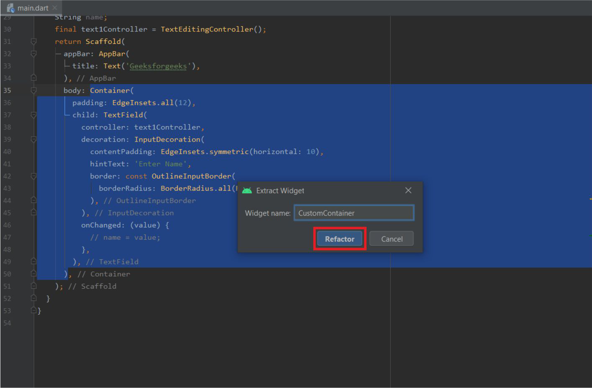

# TATADigitalTest

### A. Descriptive Questions:
  ##### 1. Can we nest the Scaffold widget? Why or Why not?
    It is recommended not to use nested scaffold and the scaffold was designed to be the single top-level container for a MaterialApp and it's typically not necessary to nest scaffolds. we should be using one Scaffold per page / screen.
  ##### 2. What are the different ways we can create a custom widget ?
    By Right Clicking on Widget:
    By Right-Clicking on the Particular widget -> Refactor -> Extract Flutter Widget (we can also use shortcut Ctrl+Alt+W)

    Give it a name and then click on refactor.

  ##### 3. How can I access platform(iOS or Android) specific code from Flutter?
     Future<void> responseFromNativeCode() async {
     String response = "";
     try {
      final String result = await platform.invokeMethod('helloFromNativeCode');
      response = result;
     } on PlatformException catch (e) {
      response = "Failed to Invoke: '${e.message}'.";
     }
     setState(() {
      _responseFromNativeCode = response;
     });
    }
  ##### 4. What is BuildContext? What is its importance?
    The BuildContext is the handle/pointer to the location of the particular widget in the widget tree. Note that every widget you create has its own BuildContext, and as a matter of fact, every widget should have its own BuildContext for them to locate themselves in the widget tree or reach out to the nearest ancestor widget.
   
